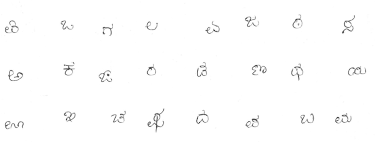
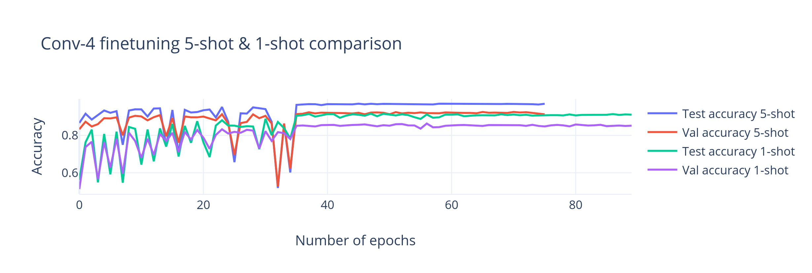

# Offline Kannada handwritten character recognition using Manifold Smoothing and Label Propagation

## Abstract
- Supervised learning techniques using deep learning models are highly effective in their application to handwritten character recognition.
- However, they require a large dataset of labelled samples to achieve good accuracies.
- For applications where particular classes of characters are difficult to train for, due to their rarity in occurrence, techniques from semi supervised learning and self supervised learning can be used to improve the accuracy in classifying these unusual classes.
- In this project, we analyze the effectiveness of using a combination of feature regularization, augmentation techniques and label propagation to classify previously unseen characters.
- We use a dataset of Kannada Handwritten characters to validate our approach. We show the improvement in accuracy as well as reduced reliance on training data compared to previous approaches.

## 1.  Preparing Data

- Dataset consists of 47 classes representing each base character of Kannada Abiguda
- Each class has 400 samples
- 24 classes used as Training Set
- 12 classes used as Test Set
- 11 classes used as Validation Set
- The images were rescaled to 84x84 pixels and converted to RGB.

### 1.1 The base set 

### 1.2 The Novel Set

### 1.3 The Validation Set

## 2.  Neural Networks

Two different convolution neural networks were used, Conv4 and Resnet12

### 2.1 Conv4 Neural Network
- A standard CNN Model with 4 layers
- Each layer consists of a Convolution followed by Max Pooling of window (2x2)
- ReLU is used as the activation function

| Layer Name  | Output Shape | Next Layer |
| ----------- | ------------ | ---------- |
| Input Layer | (84,84,3)    | Conv0      |
| Conv0       | (42,42,64)   | Conv1      |
| Conv1       | (21,21,64)   | Conv2      |
| Conv2       | (10,10,64)   | Conv3      |
| Conv3       | (5,5,64)     | AvgPool    |
| AvgPool     | (64)         | Output     |

###  2.2 Resnet12 Neural Network
- A resnet model with 12 layers
- The model is composed of 4 blocks, each having 3 convolution layer and shortcut connection between first and third layer, and a Max Pool Layer of window (3x3)
- The shortcut connection adds the output of the first layer to the third layer before passing it to the activation function (ReLU)

| Layer Name  | Output Shape | Next Layer |
| ----------- | ------------ | ---------- |
| Input Layer | (84,84,3)    | Block0     |
| Block0      | (26,26,64)   | Block1     |
| Block1      | (9,9,128)    | Block2     |
| Block2      | (3,3,256)    | Block3     |
| Block3      | (512)        | Output     |

## 3. Training

- Training consisted of pretraining followed by episodic finetuning. 
- Pretraining was done on the base set. 
- Finetuning was done on the novel set.

### 3.1 Pretraining

- The training set $C_{train}$ contains classes that have large number of numbered samples.
- Objective of pretraining is to learn a good feature representation which can be fine tuned to unseen classes. 
- Input batches of size 128 were used to improve efficiency of batch normalization, reducing overfitting and improving smoothness of gradients, each image is rotated 4 times for the self-supervision loss. 
- Stochastic Gradient Descent is used to train the network.

#### 3.1.1 Manifold Smoothing using RBF Feature Interpolation

- In order to make the decision boundaries of the hidden layer of the model more smooth, resulting in better robustness and generalization, a layer to smoothen the extracted features is used.
- We create a similarity matrix between every pair of features $z_i$ and $z_j$
- Given a set of feature vectors extracted from the CNN Layers,  $\text{z}_i \epsilon \text{R}^m$
- A smoothing function is applied to obtain $\tilde{z}$ which are forwarded to the fully connected layer for classification.
- This smoothing consists of using a Gaussian similarity function centered at $z_i$ and evaluating the probability of other feature $z_j$ using L2 norm as distance function, $d_{ij}^2 = \lVert x \rVert_{2}^2$ and $\sigma  = Var(d_{ij}^2)$ as a measure of similarity/dissimilarity of different features. 
- The similarity matrix $A$ is defined as 
$$A_{ij} = \exp(\frac{d_{ij}^2}{\sigma^2} )$$
- To ensure convergence, we normalize this similarity matrix
$$L = D^{-\frac{1}{2}}AD^{\frac{1}{2}}$$
$$where \quad D_{ii} = \sum_jA_{jj}$$
- To increase the weights of closest features and decrease the weights of features not so close to each other, we perform power iteration using the power matrix $P$
$$
P = ( I - \alpha L)^{-1}
$$
- The new features $\tilde{z_i}$ are calculated as weighted sum of their neighbors
$$
\tilde{z_l} = \sum_j P_{ij} z_j
$$

Two fully connected classifiers are trained, which use the features extracted by the CNN backbone networks and regularized using the manifold smoothing process

#### 3.1.2 Linear Classifiers

- The first classifier $C_1$ is trained to predict the class labels of the input images. A standard cross entropy loss for classification is used to train this classifier.
	- The loss function is given by:
$$
\text{L}_{\text{C}_1}(\text{x}_i, \text{y}_i; \text{W}_l, \theta ) = -ln(p(\text{y}_i | \tilde{z_l}), \text{W}_l)
$$
$$
𝑊_l \text{ is the fully connected layer with softmax activation representing } C_1.
$$ 
- The second classifier $C_2$ is utilized to provide a self-supervision type learning signal, where the rotation angle of each input image, (after being rotated by {0°, 90°,180°, 270°}) is predicted. This helps improve the learning signal and provides a certain degree of rotation invariance to the model.
	- The loss function is given by:
$$
\text{L}_{\text{C}_2}(\text{x}_i, \text{y}_i; \text{W}_r, \theta ) = -ln(p(\text{r}_i | \tilde{z_i}), \text{W}_r)
$$
$$		
   W_r \text{ is the fully connected layer with softmax activation representing } C_2
$$
$$
r_i \text{ prediction of the rotation angle. }
$$
- The overall loss to be minimized is given by:
$$
argmin \sum_{i=1}^{128} \sum_{j=1}^{4} \text{L}_{\text{C}_1}(\text{x}_i, \text{y}_i; \text{W}_l, \theta ) + \text{L}_{\text{C}_2}(\text{x}_i, \text{r}_j; \text{W}_r, \theta )
$$
### 3.2 Episodic Finetuning

- After pretraining, aim is to learn to recognize unseen classes.
- The episodic framework provides a simulation for training a meta learning model for few-shot classification tasks. 
- Our objective is to train the classifier on an unseen set of classes where only few labelled samples are available. 
- We perform 1 shot and 5 shot tests where 1 sample is used from each novel class and 5 samples are used from each novel class respectively.
- Each epoch in finetuning consists of generating an episode, calculating the loss obtained, and using backpropagation to adjust the weights accordingly.
- Query set $Q$ consists of 15 samples and support set $S$ has $k$ example images. 
- In each episode 5 classes are uniformly sampled without replacement.
- RBF interpolation is done as defined in [[#3.1.1 Manifold Smoothing using RBF Feature Interpolation]]

#### 3.2.1 Label Propagation
- The prediction of labels for the query set $Q$ using label propagation is obtained using the similarity matrix that is equivalent to the one used in the manifold smoothing step.
- The matrix $Y$ is constructed using 
	- The matrix $Y_s$ of size $(nk \times n)$ corresponding to the support set $S$, such that  $Y_{ij} = 1$ if $y_i = j$ else 0. Basically the for each row, the column corresponding to the correct label is set 1 and rest are zero.
	- The matrix $O$ which is a matrix of zeros of size $(t \times n)$, where $t$ is the number of samples in $Q$
$$
Y = \frac{Y_s}{O}
$$
- Label propagation iteratively determines the unknown labels for the union set $S \cup Q$ 
$$
F_{t+1} = \alpha L F_{t} + (1 - \alpha)Y
$$
- $L$ is the normalized similarity matrix, as defined in [[#3.1.1 Manifold Smoothing using RBF Feature Interpolation]]
- $\alpha$ is the smoothing factor between 0 and 1. 
- The sequence $F_t$ converges to 
$$
F^{*} = (I - \alpha L)^{-1}Y
$$
$$\text{ where } I \text{ is the identity matrix }$$

Two fully connected classifiers are trained, which use the features extracted by the CNN backbone networks and regularized using the manifold smoothing process

#### 3.2.2 Linear Classifiers
- The classifier $C'_1$ utilizes label propagation to compute the probabilities of the classes in the query set. The logits are converted to class probabilities using the SoftMax function. 
	- The loss function is given by
$$
L_{C'_1}(x_i, y_i; \theta) = -ln(p(y_i | \tilde{z_l}, \tilde{Z}, \tilde{Y_s}))
$$
- Since the label propagation loss tends to favor mixing of features, impacting the discriminativeness of the feature representation, a second classifier $C'_2$ is trained with the standard cross entropy loss on the union $S \cup Q$ . This classifier is similar to the one used in pretraining and helps preserving the discriminativeness of the feature representation.
	- The loss function is given by 
$$
L_{C'_2}(x_i, y_i; W_l, \theta) = -ln(p(y_i | \tilde{z_l}, W_l))
$$
- The overall loss to be minimized is the additive combination of the above: 
$$
argmin \left[\frac{1}{|Q|} \sum_{(x_i, y_i) \epsilon Q} L_{C'_1}(x_i, y_i; \theta) + \frac{1}{|S \cup Q|} \sum_{(x_i, y_i) \epsilon S \cup Q} \frac{1}{2} L_{C'_2}(x_i, y_i; W_l, \theta) \right] 
$$

## 4. Validation and Results

The hyperparameters are as given below

| Hyperparameter            | Value                       |
| ------------------------- | --------------------------- |
| Learning Rate (start)     | 0.1                         |
| Optimizer                 | Stochastic Gradient Descent |
| CNN Kernel Size           | 3 x 3                       |
| Manifold Smoothing Factor | 0.9                         |
| Dropout                   | 0.1                         |
| Batch Size                | 128 images                  |
| Nesterov Momentum         | 0.99                        |

### 4.1 Performance Evaluation
- Two different feature extractors, Conv4 and Resnet12,  are evaluated using the episodic framework.
- Conv4 has a faster training and inference time owing to its simplicity, and seems to benefit much more from the finetuning phase. 
- However, much better accuracies are obtained by the larger Resnet-12 network.
- This can be attributed to the greater width of the network, which allows a larger number of learnable parameters to be used for classification.
- Although there is a greater amount of overfitting as evidenced by the difference in test and validation accuracies, the performance on finetuning shows that the framework has good generalization capability.

### 4.2 Conv4 Network

#### 4.2.1 Pretraining
- From the following figure, we observe the convergence of training at 44 epochs, and due to the episodic nature of training, we observe large swings prior to convergence.

- The loss is monotonically decreasing over a large number of epochs, with a bump close to the convergence point.

#### 4.2.2 Finetuning

- With 1-shot finetuning, we observe that the pretrained model starts out at 50% accuracy and steadily increases with finetuning epochs until epoch 32 where the network converges to 91.04% accuracy. The loss decreases and stabilizes. 

- In 5-shot finetuning we observe a higher initial accuracy of 83% accuracy which reduces when more unseen classes are initially encountered, the network finally converges at 37 epochs to an accuracy of 96.88%. We observe the increase in validation loss corresponding to the more difficult episodes.

- comparing 1 and 5 shot finetuning results
![[conv4_1and5_shot_comparison.png]]

### 4.3 Resnet12

#### 4.3.1 Pretraining

- Compared to Conv4, we observe a shorter convergence time (35 epochs) and a higher pretraining accuracy being achieved (98.66%). This can be attributed to the increased number of channels (width) and layers (depth) of the backbone network. 

- The loss function decreases faster as well, compared to Conv4. 

#### 4.3.2 Finetuning

- Compared to Conv4, we observe that finetuning does not increase the accuracy of the network by a significant amount. This can be attributed to the stronger convergence during pretraining which allows better inference on novel classes without much finetuning required.  The low variance of the loss indicates saturation of the network.

 

- Similar to 1-shot, we observe that finetuning doesn’t increase the accuracy significantly. Due to the large number of support images (5 compared to 1 in 1-shot), we obtain a higher accuracy (99.13 % compared to 98.17% in Fig 9.9). 

- Comparing 1 and 5 shot finetuning results

### 4.4 Comparison between the networks

- From the graphs we observe that he Resnet model converges faster in pretraining compared to the Conv4 model.
- The training is stopped when the learning rate reaches 0.00001.
- The learning rate is reduced to 10% after every 10 epochs if there is no improvement in the loss (a plateau is reached).
- A Conv4 model requires a larger number of epochs to converge during the finetuning phase as well compared to the Resnet model.
- We observe that there is a significant increase of test and validation accuracy during finetuning for the Conv4 model, while finetuning doesn’t increase the accuracy of the Resnet-12 model by a significant amount.
- The increase in the number of support set samples from 1 to 5 provides a boost of ~5% accuracy for the Conv4 model and ~4% for the Resnet-12 model (comparing the validation accuracies).
- We can infer that by increasing the number of labelled examples for the unseen classes, we can initially expect about a 4% increase in accuracy.
- The gain per increase of labelled examples should diminish as it converges to supervised learning.

#### 4.4.1 Pretraining

| Backbone Network    | Conv4   | Resnet12 |
| ------------------- | ------- | -------- |
| Test Accuracy       | 88.74 % | 98.66%   |
| Validation accuracy | 83.60%  | 95.69%   |
| Number of epochs    | 91      | 71       |

#### 4.4.2 Finetuning 1-shot

| Backbone Network    | Conv4   | Resnet12 |
| ------------------- | ------- | -------- |
| Test Accuracy       | 91.03 % | 98.17%   |
| Validation accuracy | 85.14%  | 91.87%   |
| Number of epochs    | 89      | 47       |

#### 4.4.3 Finetuning 5-shot

| Backbone Network    | Conv4   | Resnet12 |
| ------------------- | ------- | -------- |
| Test Accuracy       | 96.88 % | 99.13%   |
| Validation accuracy | 91.22%  | 95.57%   |
| Number of epochs    | 75      | 44       |

### Comparison with previous works

- We compare the test accuracy and validation accuracy of the 5-shot approach with the values obtained by training the Convolutional Neural Network and Capsule Network as provided in [30]

| Classifier model                 | Proposed method with Resnet-12 (training + test set) | Capsule Network (vowels and consonants) | Convolutional Neural Network (average of vowels and consonants) |
| -------------------------------- | ---------------------------------------------------- | --------------------------------------- | --------------------------------------------------------------- |
| Training accuracy                | 98.66%                                               | 97.81%                                  | 99.5%                                                           |
| Validation accuracy              | 95.57%                                               | 89.93%                                  | 87%                                                             |
| Number of epochs for convergence | 40(as observed in the graph)                         | 50                                      | 50                                                              |

- We can observe that the number of epochs required for convergence is similar for all three networks. The amount of overfitting in the Label Propagation network is lower as indicated by the 3% difference between the training and validation accuracies, compared to the 7% difference in the capsule network and 12% difference in the CNN used in [30].

| Authors                     | Method                                            | Accuracy obtained |
| --------------------------- | ------------------------------------------------- | ----------------- |
| Manjunath et al., 2010 [11] | PCA + ANN                                         | 88.64%            |
| Karthik et al., 2015 [21]   | SVM+HOG                                           | 96.41%            |
| Karthik et al., 2018 [24]   | Deep Belief Networks                              | 97.04%            |
| Ramesh et al.,2019 [30]     | Capsule Networks                                  | 98.7%             |
| Proposed method (5 shot)    | Manifold Smoothing with Label Propagation Network | 99.13%            |

## 5. Conclusion

- We propose a new Offline Handwritten Character recognition framework that has the qualities of robustness to variations in input and easy generalization. The incorporation of unseen character classes into the framework doesn’t require the retraining of the entire network to achieve good accuracies. The incorporation is also data efficient as it only requires a small number of labelled samples to learn to classify the newer classes (only 1 example in 1-shot and 5 examples in 5-shot).
- The use of Resnet-12(a deep residual CNN), label propagation and manifold smoothing help reduce the effect of training class imbalance bias as well as reducing the overfitting of the network during the pretraining phase. The accuracy obtained on the 5-shot accuracy makes this framework competitive with the supervised learning counterparts, despite the large reduction in the number of labelled samples available (for the novel classes).

## 6. References

[1] Oriol Vinyals, Charles Blundell, et al. “Matching networks for one shot learning.” In Advances in Neural Information Processing Systems, pages 3630–3638, 2016.

[2] Alex Nichol, Joshua Achiam, and John Schulman “On first-order meta-learning algorithms”. arXiv preprint arXiv:1803.02999, 2018.

[3] Gidaris, S., Bursuc, A., Komodakis, et al. “Boosting few-shot visual learning with self- supervision.” In: Conference on Computer Vision and Pattern Recognition. pp. 8059–8068 (2019)

[4] Denny Zhou, Olivier Bousquet, et al. “Learning with local and global consistency”. In Advances in Neural Information Processing Systems, pages 321–328, 2004

[5] Y. Zhu, C. Yao, and X. Bai, “Scene text detection and recognition: Recent advances and future trends,” Frontiers of Computer Science, vol. 10, no. 1, pp. 19–36, 2016.

[6] L. R. Ragha and M. Sasikumar, “Feature analysis for handwritten kannada kagunita recognition,” International Journal of Computer Theory and Engineering, vol. 3, no. 1, p. 94, 2011.

[4] A. Amin, “Off-line arabic character recognition: the state of the art,” Pattern recognition, vol. 31, no. 5, pp. 517–530, 1998.

[7] Alireza Alaei, P. Nagabhushan, and Umapada Pal. 2011. “A Benchmark Kannada Handwritten Document Dataset and Its Segmentation”. In Proceedings of the 2011 International Conference on Document Analysis and Recognition (ICDAR ’11). IEEE Computer Society, USA, 141–145.(2011)

[8] A. Alaei, U. Pal, and P. Nagabhushan, “Dataset and ground truth for handwritten text in four different scripts,” International Journal of Pattern Recognition and Artificial Intelligence, vol. 26, no. 04, p.1253001, 2012.

DEPT OF CSE,UVCE 2019-2020 Page | 48

[9] S. M. Obaidullah, C. Halder, et al. “Phdindic 11: page-level handwritten document image dataset of 11 official indic scripts for script identification,” Multimedia Tools and Applications, vol. 77, no. 2, pp. 1643–1678, 2018.

[11] V. Manjunath Aradhya, S. Niranjan, and G. Hemantha Kumar, “Probabilistic neural- network based approach for handwritten character recognition,” International Journal of Computer & Communication Technology, vol. 1, no. 2, 3, 4., pp. 9–13, 2010.

[12] Niranjan, S. K., Vijaya Kumar, and Hemantha Kumar. "FLD based unconstrained handwritten Kannada character recognition." In 2008 Second International Conference on Future Generation Communication and Networking Symposia, vol. 3, pp. 7-10. IEEE, 2008.

[14] A. Majumdar and B. B. Chaudhuri, "Curvelet-Based Multi SVM Recognizer for Offline Handwritten Bangla: A Major Indian Script," Ninth International Conference on Document Analysis and Recognition (ICDAR 2007), Parana, 2007, pp. 491-495.

[13] Naveena, C., and VN Manjunath Aradhya. "An impact of ridgelet transform in handwritten recognition: A study on a very large dataset of kannada script." In 2011 World Congress on Information and Communication Technologies, pp. 618-621. IEEE, 2011.

[14] V. N. Murthy and A. G. Ramakrishnan, “Choice of classifiers in hierarchical recognition of online handwritten kannada and tamil aksharas.” J. UCS, vol. 17, no. 1, pp. 94–106, 2011.

[15] B. Dhandra, M. Vijayalaxmi, G. MukarambiHu, and M. HanGarge, “Writer identification by texture analysis based on kannada handwriting,” Int. J. Comm. Netw. Secur, vol. 1, no. 4, pp. 80–85, 2012.

[16] Ramya, S., & Shama, K. “Comparison of SVM kernel effect on online handwriting recognition: A case study with kannada script.” In Data Engineering and Intelligent Computing - Proceedings of IC3T 2016 (Vol. 542, pp. 75-82). (2017)

[17] D. Keysers, T. Deselaers, H. A. Rowley, L.-L. Wang, and V. Carbune, “Multi-language online handwriting recognition.” IEEE Trans. Pattern Anal. Mach. Intell., vol. 39, no. 6, pp. 1180– 1194, 2017.

[18] Ramya, S and Shama, Kumara, “The effect of pre-processing and testing methods on online kannada handwriting recognition: Studies using signal processing and statistical techniques,” Pertanika Journal of Science and Technology, vol. 26, no. 2, pp. 671–690, 2018.

[19] V. C. Hallur and R. Hegadi, “Offline Kannada handwritten numeral recognition: Holistic approach,” pp. 632–637, 2014.

[20] P. Bannigidad and C. Gudada, "Restoration of degraded Kannada handwritten paper inscriptions (Hastaprati) using image enhancement techniques," 2017 International Conference on Computer Communication and Informatics (ICCCI), Coimbatore, pp. 1-6, (2017)

[21] Karthik, S., and K. Srikanta Murthy. "Handwritten Kannada numerals recognition using histogram of oriented gradient descriptors and support vector machines." In Emerging ICT for Bridging the Future-Proceedings of the 49th Annual Convention of the Computer Society of India CSI Volume 2, pp. 51-57. Springer, Cham, 2015.

[22] P. Yadav and M. Kumar, “Kannada character recognition in images using histogram of oriented gradients and machine learning,” pp. 265– 277, 2018.

[23] Mirabdollah, M.H., Mohamed, M.A. and Mertsching, B., “Distributed averages of gradients (dag): A fast alternative for histogram of oriented gradients.” In Robot World Cup (pp. 97-108). Springer, Cham.( 2016)

[24] S. Karthik and K. S. Murthy, “Deep belief network based approach to recognize handwritten kannada characters using distributed average of gradients,” Cluster Computing, pp. 1–9, 2018.

[25] Ramesh G, Ganesh N. Sharma, J. Manoj Balaji and Champa H. N. , "Offline Kannada Handwritten Character Recognition Using Convolutional Neural Networks," 2019 IEEE International WIE Conference on Electrical and Computer E Engineering , pp. 1-5 (2019)

[26] Lee, W.S., Bartlett, P.L., Williamson, R.C.: “Lower bounds on the vc dimension of smoothly parameterized function classes.” Neural Computation 7(5), 1040–1053 (1995)

[27] Kaiming He, Xiangyu Zhang, et al. “Deep residual learning for image recognition.” In Computer Vision and Pattern Recognition, pages 770–778, 2016.

[28] Sergey Ioffe and Christian Szegedy. “Batch normalization: Accelerating deep network training by reducing internal covariate shift”. In International Conference on Machine Learning, pages 448–456, 2015.

[29] Ren, M., Ravi, S., Triantafillou, E., Snell, J, et al.” Meta-learning for semi-supervised few- shot classification”. In: International Conference on Learning Representations (2018)

[30] Ramesh. G, J. Manoj Balaji, Ganesh. N. Sharma, Champa H.N., “Recognition of Off-line Kannada Handwritten Characters by Deep Learning using Capsule Network.” International Journal of Engineering and Advanced Technology. (2019).